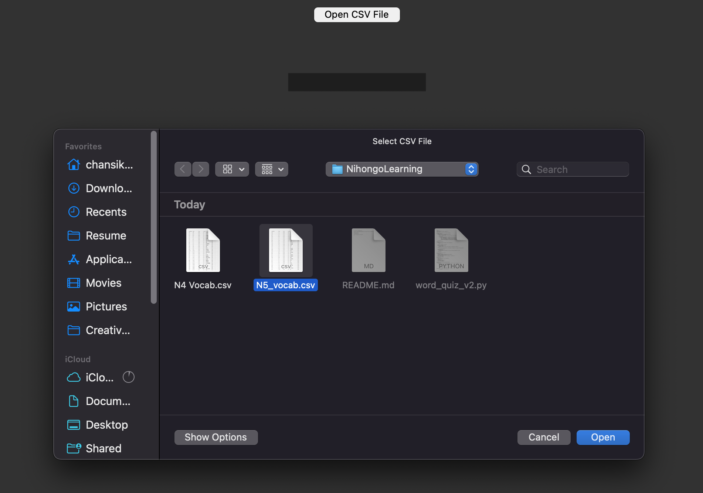

## ✨ Welcome to NihongoLearning ✨

Kana Quiz: Providing Japanese Expression, User need to input the corresponding kana.

## Getting Started

1. Clone this repo

2. Run `word_quiz_v2.py` with python

3. Upload the corresponding vocabulary file & enjoy the Hirakana/Katakana quiz!

	
	
<em>Onboarding Screenshot</em>

